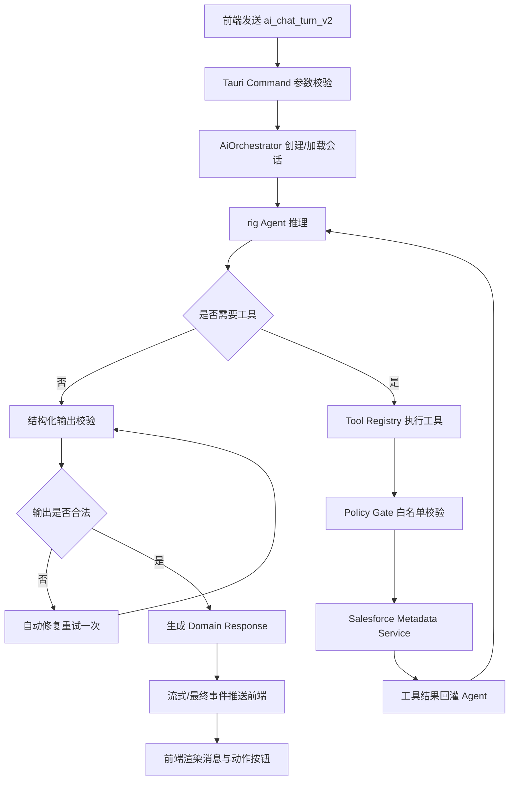
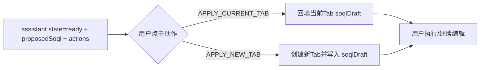
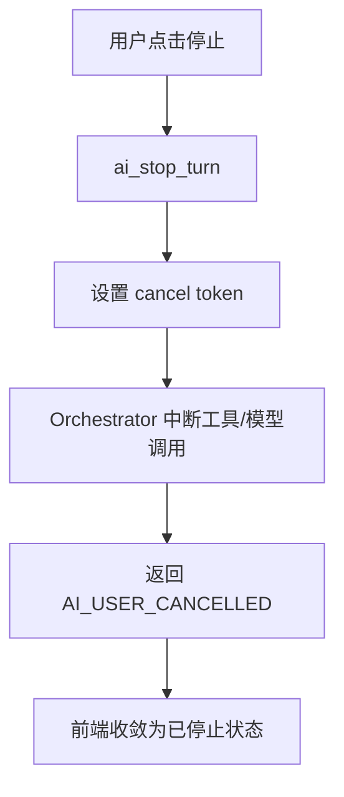

# 基于 rig.rs 的 AI 能力重构设计（可大改版）

## 1. 背景与目标

当前 AI 链路已经具备基础能力（多轮对话、工具调用、SOQL 回填、流式事件），但核心编排主要依赖手写循环和手写 JSON 解析，导致稳定性与可维护性不足：

- 工具循环由业务代码手动控制，边界条件多，扩展新工具成本高。
- LLM 输出依赖手写解析与兜底，模型漂移时容易出现异常分支。
- 对象/字段元数据虽然已能补齐 reference 相关关系，但工具域仍偏窄。
- 错误分类、可观测、恢复策略分散在命令层。

本方案目标是：

1. 以 `rig.rs` 作为后端 Agent 编排核心，落地成熟、可扩展、可观测的 AI 架构。
2. 前后端都允许大改，但保留“生成 SOQL 后可应用到当前 tab 或新建 tab”的核心用户体验。
3. 把 Salesforce 元数据能力系统化工具化，提升 AI 正确率和可解释性。
4. 建立可灰度、可回滚、可测试的工程落地路径。

---

## 2. 现状评估（关键事实）

### 2.1 后端现状

- 入口命令：`generate_soql_from_conversation`（`src-tauri/src/commands.rs`）
- 当前做法：
  - 手工组 prompt 与 metadata snapshot。
  - 手工 tools loop：`call_llm_with_tools_loop`。
  - 手工解析 JSON：`parse_llm_soql_payload`。
  - 手工工具执行分发：`execute_soql_llm_tool_call`。
- 已有亮点：
  - 已支持 `llm:soql-stream-chunk` 增量事件。
  - 已有取消机制 `stop_llm_stream_generation`。
  - 已有元数据摘要结构（含 reference/child relationship）。

### 2.2 前端现状

- AI 工作区：`src/features/main/SoqlExecutorWorkspace.tsx`
- 已支持：
  - 多轮聊天展示。
  - 生成后“应用当前Tab / 新建Tab并应用”。
  - 流式 chunk 挂载到指定消息气泡。

结论：前端体验基础可复用，后端 Agent 与 Tool 抽象应整体升级。

---

## 3. rig.rs 在本项目中的角色定位

`rig.rs` 建议承担以下职责：

1. **Agent 编排层**：承接模型推理 + 工具调用 + 结构化输出。
2. **Tool 调度层**：把 Salesforce 元数据能力封装成稳定工具协议。
3. **输出结构约束层**：通过 extractor/schema 减少脆弱 JSON 解析。
4. **可观测挂载层**：统一接入 trace、工具调用日志、失败原因分类。
5. **Provider 抽象层**：先落 OpenAI，保留后续扩展到 OpenAI-compatible/Azure 的路径。

简言之：`rig` 不取代业务逻辑本身（Salesforce API、权限、安全约束），而是取代“手写 AI 编排框架”。

---

## 4. 目标架构（重构后）

```text
Frontend Chat UI
  -> Tauri Command: ai_chat_turn
    -> AiOrchestrator (rig Agent)
      -> Tool Registry (Salesforce Metadata Tools)
        -> Salesforce Service / Cache
      -> Structured Output Validator
    -> Domain Response (answer/clarify/generate + actions)
  -> Frontend renders cards + actions (apply current tab / new tab)
```

### 4.1 后端分层

- `ai/`（新模块）
  - `orchestrator.rs`：会话编排、调用 rig agent。
  - `agent_factory.rs`：按 provider/model 构建 agent。
  - `tools/`：所有工具函数实现与注册。
  - `schema.rs`：结构化输出定义（serde + 校验）。
  - `policy.rs`：安全策略（只允许 metadata 工具）。
  - `telemetry.rs`：trace、日志、指标。
- `commands.rs`
  - 仅保留命令参数校验、调用 orchestrator、事件透传。

### 4.2 前端分层

- `features/main/SoqlExecutorWorkspace.tsx` 继续作为交互入口。
- 新增 `features/ai/`（建议）：
  - `aiSessionStore.ts`：会话状态机（idle/running/cancelled/failed）。
  - `aiMessageMapper.ts`：将后端结构化消息映射为 UI 卡片。
  - `aiActionHandlers.ts`：统一处理 apply current/new tab。
- `api/index.ts`：新增/重命名更语义化接口（见第 7 节）。

---

## 5. Tool 设计（从“够用”升级为“可持续”）

当前仅两个工具不够支撑复杂问答和高质量 SOQL。建议扩展为工具箱（第一期即实现）：

### 5.1 对象发现类

1. `find_objects`
- 入参：`keyword`, `limit`, `queryable_only`
- 作用：模糊检索对象

2. `list_objects_by_capability`
- 入参：`queryable`, `createable`, `updateable`, `limit`
- 作用：按能力筛对象，降低误选

### 5.2 对象详情类

3. `get_object_metadata`
- 入参：`object_name`, `include_reference_parents`
- 作用：取字段+关系摘要（保留你现有 childRelationshipName 补齐）

4. `get_object_relationship_graph`
- 入参：`object_name`, `depth`, `direction(parent|child|both)`
- 作用：返回轻量关系图，帮助模型理解 join 路径

5. `get_field_metadata`
- 入参：`object_name`, `field_name`
- 作用：精确字段约束（type/length/picklist/filterable/groupable/sortable）

6. `search_fields`
- 入参：`object_name`, `keyword`, `type_filter`, `limit`
- 作用：字段量大时快速定位

### 5.3 SOQL 约束与校验类

7. `validate_soql_syntax`
- 入参：`soql`
- 作用：本地规则校验（禁 DML、禁越权关键字、基础语法）

8. `normalize_soql`
- 入参：`soql`
- 作用：格式规整，减少前端展示差异

9. `estimate_soql_risk`
- 入参：`soql`
- 作用：风险提示（无 LIMIT、宽字段、潜在慢查询）

10. `explain_soql`
- 入参：`soql`
- 作用：给用户可解释说明（对象、字段、过滤、排序）

### 5.4 会话上下文类

11. `get_recent_user_context`
- 入参：`conversation_id`
- 作用：返回最近对象偏好、常用字段，增强多轮一致性

12. `resolve_ambiguous_terms`
- 入参：`term`
- 作用：将“客户/联系人/商机”等业务词映射到候选对象

---

## 6. 为什么要这样改（核心理由）

1. **降低脆弱性**
- 结构化输出 + schema 校验替代手写 `Value` 解析，减少模型偏移导致的崩溃。

2. **增强可扩展性**
- 工具注册化后，新增能力不用改核心循环，只增加 tool + policy。

3. **提高正确率**
- “关系图 + 字段约束 + 术语消歧”对 SOQL 准确率提升明显。

4. **提升工程质量**
- 统一错误码、观测链路、测试夹具，能做到可复盘、可回归、可灰度。

5. **减少前端复杂分支**
- 后端输出统一 Action 类型，前端只做渲染与动作执行。

---

## 7. 前后端接口改造建议

## 7.1 后端命令（建议）

保留旧接口一段时间，新增 v2 接口：

1. `ai_chat_turn_v2`
- 请求：
  - `sourceId`
  - `conversationId?`
  - `message`
  - `streamRequestId?`
  - `uiContext`（当前 tab soql/object hint/selected fields）
- 返回：
  - `conversationId`
  - `state`：`answer | clarify | ready | failed`
  - `assistantMessage`
  - `questions[]`
  - `proposedSoql?`
  - `actions[]`（如 `APPLY_CURRENT_TAB`, `APPLY_NEW_TAB`）
  - `diagnostics`（工具调用摘要、风险提示）

2. `ai_stop_turn`
- 语义同现有 `stop_llm_stream_generation`，命名统一

3. `ai_get_capabilities`
- 返回后端可用工具、模型、策略版本，供前端自适应

## 7.2 前端 API 改造

- `api.generateSoqlFromConversation` -> `api.aiChatTurnV2`
- `api.stopLlmStreamGeneration` -> `api.aiStopTurn`
- 增加 `api.aiGetCapabilities`

## 7.3 前端状态模型改造

消息模型建议升级：

```ts
type AiMessage = {
  id: string;
  role: "user" | "assistant" | "system";
  content: string;
  state?: "answer" | "clarify" | "ready" | "failed";
  questions?: string[];
  proposedSoql?: string;
  actions?: Array<"APPLY_CURRENT_TAB" | "APPLY_NEW_TAB" | "ASK_MORE">;
  diagnostics?: {
    toolsUsed?: string[];
    riskLevel?: "low" | "medium" | "high";
    warnings?: string[];
  };
};
```

---

## 8. 后端实现细化（rig 最佳实践落地）

## 8.1 Agent Factory

- 按 `provider/model/timeout` 构建 rig agent。
- System prompt 只保留高层规则，不再堆大段硬编码策略。
- 元数据通过工具按需拉取，不在 prompt 中塞大快照。

## 8.2 Tool Registry + Policy Gate

- 所有工具实现 `Tool` trait 并集中注册。
- `policy.rs` 强制白名单：AI 链路只允许 metadata 类工具。
- 每次工具调用记录：入参摘要、耗时、结果大小、错误类型。

## 8.3 Structured Output

- 用强类型结构承接输出：
  - `AiTurnOutput { state, answer, questions, proposed_soql, ... }`
- 校验失败进入“修复器”分支：
  - 一次自动修复重试
  - 仍失败则统一 `clarify` 并返回最小引导问题

## 8.4 Streaming

- 保留现有事件名兼容层：`llm:soql-stream-chunk`
- 新增事件（可选）：
  - `llm:tool-call-start`
  - `llm:tool-call-end`
  - `llm:turn-finished`

## 8.5 Cache

- 增加元数据缓存层（内存 + TTL，可选持久化）
- key: `sourceId:objectName:apiVersion`
- 支持主动失效（数据源切换、对象刷新）

---

## 9. 前端实现细化

1. 保留当前“应用当前Tab / 新建Tab并应用”按钮动作。
2. 把按钮显示条件从 `status===ready && soql` 改为 `actions` 驱动。
3. 对话区新增“诊断折叠面板”（显示工具链摘要与风险提示）。
4. 发送区加入“推荐补充信息快捷按钮”（对象、时间范围、字段范围）。
5. 对失败态统一渲染（重试、反馈、复制追踪ID）。

---

## 10. 数据结构与迁移

### 10.1 新增设置

- `llm.provider`（先支持 openai）
- `llm.model`
- `llm.timeoutMs`
- `llm.maxToolRounds`
- `llm.maxTurnDurationMs`
- `llm.enableDiagnostics`

### 10.2 会话存储

建议从纯内存改为“内存 + 持久化摘要”：

- `ai_conversation`：会话头（id/source/model/createdAt/updatedAt）
- `ai_message`：消息体（role/content/state/toolTrace）

收益：应用重启后可恢复上下文，便于问题复盘。

---

## 11. 错误模型与恢复策略

统一错误码（示例）：

- `AI_MODEL_TIMEOUT`
- `AI_MODEL_INVALID_OUTPUT`
- `AI_TOOL_NOT_ALLOWED`
- `AI_TOOL_EXECUTION_FAILED`
- `AI_POLICY_VIOLATION`
- `AI_USER_CANCELLED`

恢复策略：

1. 模型输出不合法 -> 自动修复 1 次。
2. 工具失败 -> 返回 clarify，并附可执行建议。
3. 超时 -> 保留已产生的 assistant 文本 + 提示缩小范围。
4. 用户取消 -> 立即结束 turn，状态可恢复继续聊。

---

## 12. 测试与验收

### 12.1 后端测试

1. 工具单测：每个工具入参/异常/边界。
2. Agent 契约测试：固定 mock LLM 响应，验证状态机。
3. 结构化输出测试：非法 JSON、字段缺失、错类型。
4. 策略测试：禁止数据读写工具被调用。
5. 负载测试：高并发多会话 + 取消请求。

### 12.2 前端测试

1. 聊天流式渲染与 requestId 路由。
2. ready 状态下两种应用动作。
3. clarify 问题列表追问闭环。
4. failed 状态重试与提示。

### 12.3 业务验收指标

- 首轮可用回复率 >= 95%
- 生成 SOQL 可执行率 >= 90%
- 平均响应时间（含工具）<= 6s（P50）
- 用户取消后 200ms 内 UI 收敛

---

## 13. 分阶段落地计划

### Phase 0（1-2 天）
- 引入 `rig` 依赖与最小 PoC：1 个工具 + 结构化输出。

### Phase 1（3-5 天）
- 完整 Tool Registry（至少 8 个工具）
- `ai_chat_turn_v2` 全链路跑通
- 前端适配 actions 驱动渲染

### Phase 2（2-3 天）
- 可观测与错误码统一
- 缓存策略与会话持久化
- 回归与灰度开关

### Phase 3（1-2 天）
- 去除旧手写循环主路径（保留 fallback 开关）
- 文档与测试基线固化

---

## 14. 端到端流程图（重构后）

## 14.1 主流程（聊天 + 工具 + 结构化输出）



## 14.2 生成 SOQL 后应用动作流程



## 14.3 取消与失败流程



---

## 15. 与现有代码的映射关系（重点改造位）

1. `src-tauri/src/commands.rs`
- 把 `call_llm_with_tools_loop`、`execute_soql_llm_tool_call`、`parse_llm_soql_payload` 下沉到 `ai/` 新模块。

2. `src-tauri/src/llm.rs`
- 从“协议细节+重试细节集合”转向“provider client 封装”，由 orchestrator 统一调用。

3. `src-tauri/src/app_state.rs`
- 新增 `ai_runtime`（工具注册、缓存、会话管理、可观测句柄）。

4. `src/features/main/SoqlExecutorWorkspace.tsx`
- 保留核心交互；改为消费 v2 响应结构和 actions。

5. `src/api/index.ts`
- 新增 v2 API 封装，保留旧接口兼容期。

---

## 16. 风险与控制

1. 风险：重构范围大，短期引入回归。
- 控制：feature flag 双轨运行（legacy/rig）。

2. 风险：工具数量增加导致耗时上升。
- 控制：限制每轮工具次数、全局超时、缓存命中优先。

3. 风险：结构化输出仍可能失败。
- 控制：强校验 + 自动修复 + clarify 兜底。

4. 风险：前端状态机复杂化。
- 控制：actions 驱动渲染，减少散乱条件分支。

---

## 17. 建议的最终形态

- 后端：`rig` 负责 AI 编排，业务服务负责真实元数据能力，策略层负责安全边界。
- 前端：对话 UI 保持简洁，动作与状态由结构化协议驱动。
- 结果：从“能跑”升级到“可持续迭代、可观测、可治理”的 AI 功能体系。

---

## 18. 参考资料（rig 官方）

- Agent 概念：https://docs.rig.rs/docs/concepts/agent
- Tools 概念：https://docs.rig.rs/docs/concepts/tools
- Extractor（结构化抽取）：https://docs.rig.rs/docs/concepts/extractor
- Observability：https://docs.rig.rs/docs/concepts/observability
- OpenAI 集成：https://docs.rig.rs/docs/integrations/providers/openai

